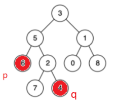

## 236最近公共祖先

>https://leetcode.cn/problems/lowest-common-ancestor-of-a-binary-tree/submissions/

### 思路1：递归判断左右子树

需要进行递归判断，思路如下：
1. 明确公共祖先,代表q和p分别在该节点的左右两侧
2. 通过判断子树来查找q和p节点的位置
3. 进行递归判断，从根开始往下判断。如果qp都在该节点左边，则往左走，都在右边往右走。当走到第一个在左右的节点，就是公共祖先
4. 注：该节点本身也算左右子树的其中一个，即节点本身也是自己的祖先


```cpp
/**
 * Definition for a binary tree node.
 * struct TreeNode {
 *     int val;
 *     TreeNode *left;
 *     TreeNode *right;
 *     TreeNode(int x) : val(x), left(NULL), right(NULL) {}
 * };
 */
class Solution {
public:
    //查找val节点的位置，判断是否为子树
    bool isSubTree(TreeNode* root,TreeNode* x)
    {
        if(root==nullptr){
            return false;
        }

        if(root==x){
            return true;
        }

        return isSubTree(root->left,x)||isSubTree(root->right,x);
    }

    TreeNode* lowestCommonAncestor(TreeNode* root, TreeNode* p, TreeNode* q) {
        if(root==nullptr){
           return nullptr;
        }
        //祖先可以是自己
        if(root==q || root==p){
            return root;
        }


        //q节点的位置
        bool isLeftq=isSubTree(root->left,q);
        bool isRightq=!isLeftq;
        //p节点的位置
        bool isLeftp=isSubTree(root->left,p);
        bool isRightp=!isLeftp;

        if((isLeftq && isRightp)||(isLeftp && isRightq)){
            return root;
        }
        else if(isLeftp && isLeftq)
        {
            return lowestCommonAncestor(root->left,p,q);
        }
        else if(isRightq && isRightp)
        {
            return lowestCommonAncestor(root->right,p,q);
        }
        else{
            return nullptr;
        }
    }
};
```

这个方法的缺点就是时间过长，且如果树的结构不够优化的话（比如单边树）就会出现递归调用层级过多而导致的栈溢出

>执行用时：516 ms, 在所有 C++ 提交中击败了5.16%的用户
>
>内存消耗：13.6 MB, 在所有 C++ 提交中击败了99.69%的用户
>
>通过测试用例：31 / 31

----

### 思路2：找路径

找到节点p和q到根部的路径，这时候只需要判断路径中第一个重合的部分即为需要查找的公共祖先

比如这样一棵树



~~~
p到根的路径
3 - 5 - 6

q到根的路径
3 - 5 - 2 - 4
~~~

我们找寻这两个路径之间的重合点，首先第一个操作就是保证这两个栈的元素个数相同。利用`while`循环先pop掉更大的哪一个栈，保证元素个数相同

~~~
p处理后
3 - 5 - 6 
q处理后
3 - 5 - 2
~~~

利用栈的`top`接口访问栈顶元素，首个元素分别是2和6，不相同，一起pop。

第二个元素都是5，相同！这个就是距离他们最近的公共祖先！

因为题目要求我们返回节点的地址`TreeNode*`，所以我们需要在栈中保存路径的指针，而不是路径的值。这样也能避免出现相同值节点的问题。

-----

完整代码如下：

~~~cpp
/**
 * Definition for a binary tree node.
 * struct TreeNode {
 *     int val;
 *     TreeNode *left;
 *     TreeNode *right;
 *     TreeNode(int x) : val(x), left(NULL), right(NULL) {}
 * };
 */
class Solution {
public:
    //查找节点到根的距离
    bool FindPath(TreeNode*root,TreeNode*x,stack<TreeNode*>& s){
        if(root==nullptr){
            return false;
        }
        //不管三七二十一，先把节点入栈
        s.push(root);
        if(root==x){
            return true;
        }

        if(FindPath(root->right,x,s)){
            return true;
        }

        if(FindPath(root->left,x,s)){
            return true;
        }

        //如果上面两个if（即左右都没有找到节点x）
        //那么说明root不是路径中的节点，所以需要出栈
        s.pop();
        return false;
    }

    TreeNode* lowestCommonAncestor(TreeNode* root, TreeNode* p, TreeNode* q) 
    {
        stack<TreeNode*> Path_q,Path_p;
        FindPath(root,p,Path_p);
        FindPath(root,q,Path_q);
        
        //保证两个栈大小一致，谁大pop谁
        while(Path_q.size()>Path_p.size()){
            Path_q.pop();
        }
        while(Path_p.size()>Path_q.size()){
            Path_p.pop();
        }
        //如果栈顶元素不相等，则都进行pop
        while(Path_p.top()!=Path_q.top())
        {
            Path_q.pop();
            Path_p.pop();
        }

        //结束后代表相等，直接返回栈顶元素即可
        return Path_p.top();
    }
};
~~~

> 执行用时：16 ms, 在所有 C++ 提交中击败了67.28%的用户
>
> 内存消耗：16.4 MB, 在所有 C++ 提交中击败了14.68%的用户
>
> 通过测试用例：31 / 31