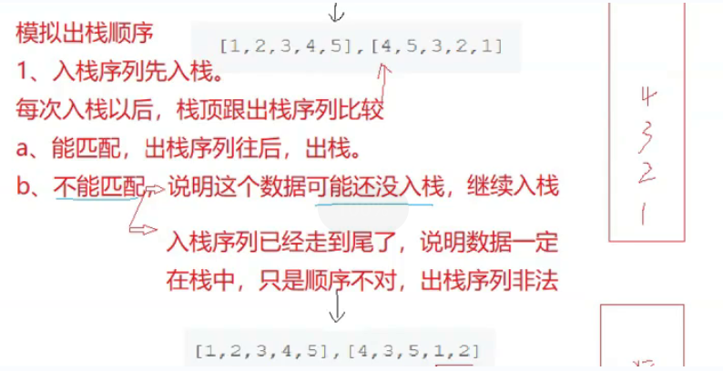

## JZ31栈的压入、弹出序列

> https://www.nowcoder.com/practice/d77d11405cc7470d82554cb392585106?tpId=13&&tqId=11174&rp=1&ru=/activity/oj&qru=/ta/coding-interviews/question-ranking

解题思路如下

~~~cpp
//第一个版本
class Solution {
public:
    bool IsPopOrder(vector<int> pushV,vector<int> popV) {
        stack<int> S;
        int i=0;
        for(auto e: pushV)
        {
            S.push(e);
            if(e == popV[i])
            {
                i++;
                S.pop();
                while(i < popV.size() && !S.empty())
                {
                    if(S.top() == popV[i])
                    {
                        S.pop();
                        i++;
                    }
                    else{
                        break;
                    }
                }
            }
        }
        if(i < popV.size())
        {
            return false;
        }
        return true;
    }
};
~~~

上面这个版本多了一个没必要的if，去掉那个if也是正确的

~~~cpp
//第二版本
class Solution {
public:
    bool IsPopOrder(vector<int> pushV,vector<int> popV) {
        stack<int> S;
        int i=0;
        for(auto e: pushV)
        {
            S.push(e);
            while(i < popV.size() && !S.empty())
            {
                if(S.top() == popV[i])
                {
                    S.pop();
                    i++;
                }
                else{
                    break;
                }
            }
            
        }
        if(i < popV.size())
        {
            return false;
        }
        return true;
    }
};
~~~

原本想的是遍历出栈序列结束之后，用if进行判断。

实际上这两个if语句可以直接用empty判断来替代！

~~~cpp
class Solution {
public:
    bool IsPopOrder(vector<int> pushV,vector<int> popV) {
        stack<int> S;
        int i=0;
        for(auto e: pushV)
        {
            S.push(e);
            while(i < popV.size() && !S.empty())
            {
                if(S.top() == popV[i])
                {
                    S.pop();
                    i++;
                }
                else{
                    break;
                }
            }
            
        }

        return S.empty();
    }
};
~~~

## 为啥OJ题不用引用传参？

因为不使用引用传参的时候，会进行一次深拷贝。这时候对传参的内容进行修改，不会影响`main`中的内容

部分情况下，修改了原本的内容可能会导致OJ题给你判错

* OJ题目所给样例的传参一般不考虑效率